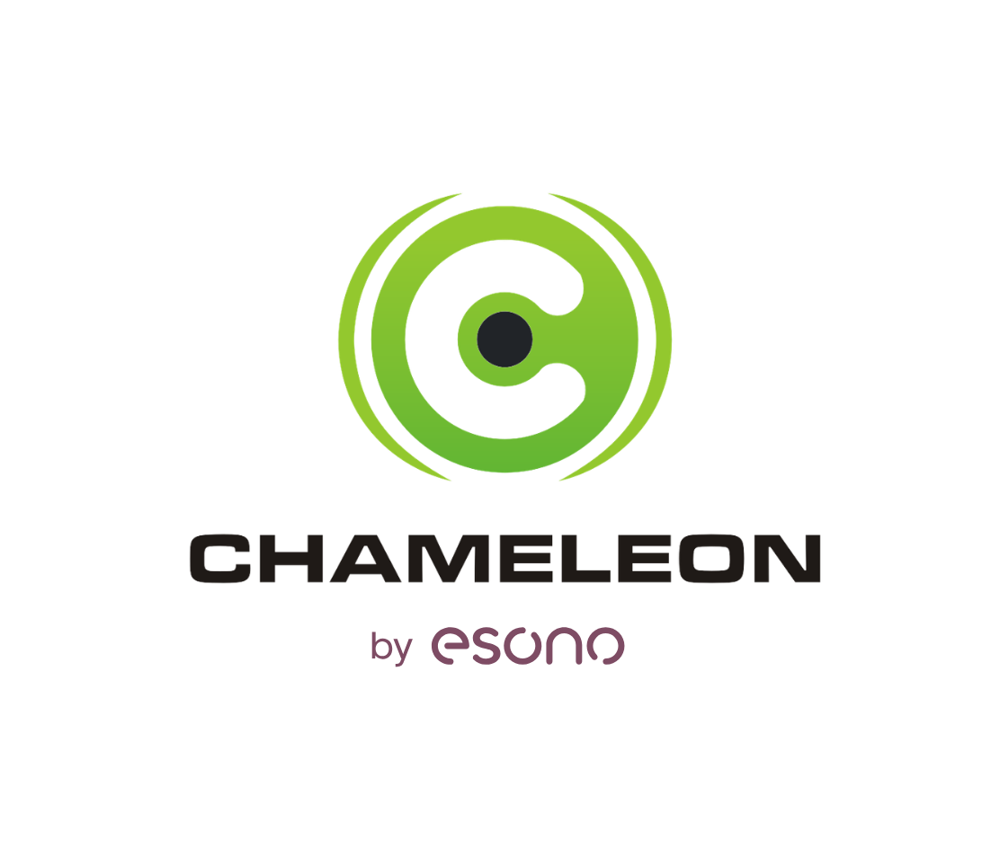

<p align="center">
    <a href="https://chameleonsystem.com" target="_blank">
        
    </a>
    <br />
    <span>
        The E-Business Platform
    </span>
</p>

Chameleon System is e-commerce and content management redefined: Flexible, based on Symfony, customer- and
project-oriented. Chameleon is a product of the [ESONO AG](https://www.esono.de/).

Demo
----

Find a demo at [https://demo.chameleon-system.de](https://demo.chameleon-system.de)

Documentation
-------------

The user manual and technical documentation in English language are currently in progress.

The user manual in German language is available here: [https://manual.chameleon-system.de](https://manual.chameleon-system.de)

Source of Truth
---------------

The canonical development repository is the source of truth for development and collaboration. GitHub and openCode
repositories are public push mirrors.

Installation
------------

# Installing Chameleon System 8.x

This guide describes a manual installation of Chameleon System 8.x using the standard application repository. The default application includes the CMS, Shop, and Shop Theme packages.

The examples use the `app/` and `web/` directory layout and a Bash-compatible shell. Run application commands from the project root unless stated otherwise. Replace example paths, hostnames, and credentials with your own values.

> **Before you begin:** You need an initial Chameleon database and matching media files compatible with the packages you intend to install. Composer installs the application code; it does not create the initial Chameleon system tables and configuration data. If no compatible initial database is supplied with your selected release, obtain one from the project maintainers before proceeding. An empty database alone is not sufficient.

This is a fresh-installation guide, not an upgrade procedure for an existing website. Release-specific requirements and migration instructions shipped with the installed packages take precedence over the general steps below.

## Requirements

| Component | Requirement |
| --- | --- |
| PHP | A PHP version supported by the selected Chameleon release. Use PHP 8.3 for the 8.0 release line unless the selected release explicitly supports another version. |
| Composer | Composer 2. |
| Git | Required to obtain the application and preserve its symbolic links. |
| Database | A MySQL or MariaDB environment compatible with the selected release and initial database. |
| Cache | A running Memcached service. The configuration below also uses a separate Memcached instance for sessions. |
| Web server | Apache or nginx with PHP support, configured to serve the `web/` directory. |
| Initial data | A release-compatible Chameleon database and its corresponding media files. |

The Base package requires these PHP extensions:

```text
curl
gd
memcached
mysqli
pdo
pdo_mysql
tidy
```

Additional dependencies may require other extensions. Install every extension reported as missing by Composer. A PHP version accepted by a dependency constraint is not, by itself, confirmation that the application supports that PHP release.

Check your environment:

```bash
php -v
php -m
composer --version
git --version
```

The PHP command-line environment and the PHP runtime used by the web server must both meet the requirements. Use a filesystem and Git configuration that preserve symbolic links. On Windows, run the examples in a suitable Linux environment, such as WSL.

Keep the installation private until configuration and validation are complete. Run Composer as the application or deployment user, not as root.

## 1. Download the application

```bash
git clone https://github.com/chameleon-system/chameleon-system.git chameleon
cd chameleon
```

The application repository supplies the project structure. Composer installs the Chameleon packages into `vendor/`.

The repository contains symbolic links, including `app/console`, `web/index.php`, and `web/.htaccess`. Their targets become available after dependency installation. Do not replace them with plain text files containing the target paths.

## 2. Select the Chameleon release and install dependencies

For a new checkout whose Chameleon dependencies point to development branches, replace those requirements with stable 8.x constraints:

```bash
composer require --no-update \
  'chameleon-system/chameleon-base:^8.0' \
  'chameleon-system/chameleon-shop:^8.0' \
  'chameleon-system/chameleon-shop-theme-bundle:^8.0'

composer update --with-all-dependencies --no-scripts
```

The constraint `^8.0` allows releases within major version 8 and excludes version 9. Composer selects versions that satisfy the complete dependency graph. The packages do not need identical patch numbers.

Choose constraints that match your initial database and application configuration. For example, use `~8.0.0` instead of `^8.0` when the installation must remain within the 8.0 minor line. A broader constraint does not remove release-specific configuration or migration requirements.

`--no-scripts` postpones parameter generation, cache clearing, and asset installation until the configuration and database are ready.

Check the installed packages:

```bash
composer show 'chameleon-system/*'
composer check-platform-reqs
```

Keep the resulting `composer.json` and `composer.lock` with your project. Record the application revision used for the installation as well.

**For a project that already provides an approved 8.x lock file, keep its requirements and use this instead of the dependency-update commands above:**

```bash
composer install --no-scripts
```

Do not bypass platform or security checks to force an incompatible dependency set to install.

## 3. Configure the application

Create the local parameter file without overwriting an existing configuration:

```bash
if [ ! -f app/config/parameters.yml ]; then
  cp app/config/parameters.yml.dist app/config/parameters.yml
fi
```

Generate a secret:

```bash
php -r 'echo bin2hex(random_bytes(32)), PHP_EOL;'
```

Edit the corresponding values in `app/config/parameters.yml`. The following is an excerpt; retain and configure the other entries from the template.

```yaml
parameters:
  secret: 'REPLACE_WITH_THE_GENERATED_SECRET'

  database_host: '127.0.0.1'
  database_port: 3306
  database_name: 'chameleon'
  database_user: 'chameleon'
  database_password: 'REPLACE_WITH_DATABASE_PASSWORD'

  chameleon_system_core.cache.memcache_server1: '127.0.0.1'
  chameleon_system_core.cache.memcache_port1: '11211'

  chameleon_system_core.cache.memcache_sessions_server1: '127.0.0.1'
  chameleon_system_core.cache.memcache_sessions_port1: '11212'
```

For this example, start separate Memcached instances on ports `11211` and `11212`. Installing the PHP extension does not start these services. In a container environment, use the appropriate service names instead of loopback addresses.

Do not use the same Memcached instance for application caching and sessions: flushing the application cache would also remove the sessions. A different session-storage configuration is possible, but it must be configured consistently throughout the application.

Also review the database settings in `app/config/config.yml`. Set `doctrine.dbal.server_version` to the correct platform/version value for your database server and installed Doctrine DBAL version. Keep the connection charset and table defaults consistent with the initial database. Do not treat values copied from the application template as a database support matrix.

Configure mail delivery and other environment-specific parameters before using features that depend on them. Keep local credentials and secrets out of version control. During evaluation, prevent outgoing production email, payment requests, and other external side effects.

## 4. Check bundle registration and routing

The application configuration must match the installed Chameleon packages. Check the release instructions included in `vendor/chameleon-system/chameleon-base/`, including the applicable `UPGRADE-*.md` file.

For an 8.0-based application skeleton, ensure that the following bundles are registered in `app/AppKernel.php` when required by the installed release. Add missing entries to `registerBundles()` before it returns `$bundles`:

```php
$bundles[] = new \ChameleonSystem\MarkdownCmsBundle\ChameleonSystemMarkdownCmsBundle();
$bundles[] = new \ChameleonSystem\FieldJsonEditorBundle\ChameleonSystemFieldJsonEditorBundle();
$bundles[] = new \Scheb\TwoFactorBundle\SchebTwoFactorBundle();
```

Do not register a bundle twice or copy registrations for classes absent from the selected release. Keep the other bundle registrations supplied by the application.

In `app/config/routing.yml`, ensure that the required backend routes are present. Merge missing entries rather than replacing the entire file:

```yaml
chameleon_system_security:
  resource: '@ChameleonSystemSecurityBundle/src/Controller/'
  type: attribute

app_logout:
  path: /cms/logout
  methods: GET

chameleon_system_cms_dashboard_bundle:
  resource: '@ChameleonSystemCmsDashboardBundle/Resources/config/routing.yml'
```

The initial-user command requires `ChameleonSystemDistributionBundle`. The standard application registers it in the `dev` and `test` environments, which is why the bootstrap commands below use `--env=dev`. Keep development dependencies installed until bootstrap is complete.

For other 8.x releases, apply their corresponding configuration requirements before booting the application.

## 5. Initialize the database and restore media

Create a dedicated, empty database and an application user with access to that database. Match the database name and credentials to `parameters.yml`. Do not use a database administrator account as the application account.

Use an initial database whose schema, system records, and migration state match the installed packages. It must contain the required language, portal, user-role, and other system configuration records, not just empty tables.

Installation resources are maintained in the `chameleon-resources` repository. They can be downloaded outside the application's public directory:

```bash
git clone https://github.com/chameleon-system/chameleon-resources.git ../chameleon-resources
```

Select the database and media package designated for your release. Do not assume that the repository's default branch, the newest-looking SQL filename, or the MySQL version in a dump header identifies a compatible Chameleon release.

After selecting the compatible SQL file, import it into the dedicated database:

```bash
mysql \
  --host=127.0.0.1 \
  --port=3306 \
  --user=chameleon \
  --password \
  chameleon < /path/to/chameleon-initial-database.sql
```

The SQL path is a placeholder for your selected file. The command prompts for the database password. Adapt the connection arguments to your environment; use the equivalent MariaDB client when appropriate.

> **Warning:** Import only into the database prepared for this installation. SQL dumps may replace or delete existing tables. Do not import over a running project.

Restore the corresponding media files. The standard application includes `web/chameleon/mediapool/`; preserve the directory structure referenced by the database and restore any additional file storage included with the initial data package. Retain the licenses and attribution supplied with those resources.

Chameleon manages database changes through its own migration system. Do not substitute `doctrine:schema:create` or `doctrine:schema:update --force` for the initial database import. A database from an earlier major version requires a separate upgrade procedure.

Do not continue with an empty, incomplete, or incompatible database.

## 6. Set filesystem permissions

Ensure that the PHP runtime and deployment user can access the installed application and follow its symbolic links.

Grant write access only where needed: the runtime cache and logs under `var/`, the media/upload locations, and the generated-content directories used by your configuration. The deployment user also needs permission to install assets under `web/`.

Keep application code and configuration read-only to the web-server account where possible. Use suitable ownership, groups, or access-control lists. Do not make the entire project world-writable.

## 7. Create the initial backend user

Once the database, configuration, and services are ready, check console startup:

```bash
php app/console list --env=dev
```

For an initial database with no backend user other than the reserved `www` account, run:

```bash
php app/console chameleon_system:bootstrap:create_initial_backend_user --env=dev
```

Follow the prompts to enter a username and password. Do not use `www` as the username; it is reserved.

This command creates the initial backend user and its system associations. After signing in, complete the user's profile and review its permissions. If the imported database already contains a backend user, use the account-management procedure for that database instead. Do not delete users to bypass the bootstrap command's restrictions.

## 8. Prepare cache and assets

After the database and code are aligned, run:

```bash
php app/console cache:clear --env=dev
php app/console assets:install --symlink --relative web --env=dev
```

Complete any theme configuration required by the selected initial data package, including its snippet chain and media files. The application, theme, and database must form a matching installation.

## 9. Configure the web server and domain

Set the document root to:

```text
/path/to/chameleon/web
```

Use `index.php` as the front controller. Do not expose the project root, configuration files, database dumps, or the entire `vendor/` directory.

With Apache, enable the modules and override permissions required by the supplied `web/.htaccess`, including URL rewriting, and allow the application to use its symbolic links. With nginx, configure the equivalent routing and access restrictions explicitly; nginx does not process `.htaccess` files. Preserve protection for private storage and disable PHP execution in upload locations.

Configure the selected hostname in DNS or the local hosts file and in the web server's virtual host. Open the backend at:

```text
https://your-hostname/cms
```

Sign in with your backend account and set the domain for the appropriate Chameleon portal. The web-server hostname and the application's portal/domain configuration must agree.

Keep the site restricted to authorized users while completing setup. Enable HTTPS before exposing it publicly.

## 10. Validate the installation

Run:

```bash
composer validate
composer check-platform-reqs
composer audit
composer show 'chameleon-system/*'
```

Resolve platform failures and assess security findings before deployment. These commands check dependencies and configuration; they do not replace functional tests.

Confirm that:

- The console starts, and backend sign-in and sign-out work.
- The frontend responds on the configured domain and loads its styles, scripts, and media.
- A page can be edited and saved, and uploaded files can be accessed as intended.
- Clearing the application cache does not remove active sessions.
- The database migration state matches the installed packages, with no outstanding required updates.
- Application and web-server logs show no new critical errors during these checks.

Configure scheduled jobs, email, and external integrations required by your site before putting those features into use.

## Production deployment

Deploy the application revision, configuration changes, and `composer.lock` that passed validation. Do not resolve new dependency versions on the production server.

After initial-user creation and development validation, install production dependencies and prepare the production cache:

```bash
composer install --no-dev --prefer-dist --optimize-autoloader --no-scripts
composer check-platform-reqs --no-dev
php app/console cache:clear --env=prod --no-debug
php app/console assets:install --symlink --relative web --env=prod --no-debug
```

Configure the HTTP runtime to use the production environment with debugging disabled. The console flags above do not change the environment used by web requests.

Before opening access, repeat the functional checks against the production runtime. Confirm HTTPS, protected secrets, restricted database/cache access, appropriate filesystem permissions, disabled debug access, and working database and media backups. Remove or disable demonstration accounts and review any imported integration settings.

For later deployments, continue using `composer install` with the approved lock file. Treat changes to package versions, database state, or the PHP/database platform as a separate update that requires testing.

## Troubleshooting

| Problem | What to check |
| --- | --- |
| Composer reports missing extensions or an unsupported PHP version | Check both CLI and web-server PHP installations. Install the required extensions or select the PHP version supported by the release. |
| A file displays a relative path instead of running PHP | The checkout or deployment may have converted a symbolic link into a text file. Restore the repository's links and verify their targets. |
| Missing tables, configuration records, or generated database classes | Check that the initial database is complete and compatible with the installed packages. |
| A bundle class, service, or backend route is missing | Match bundle registration and routing to the installed release, then rebuild its cache. |
| Memcached connection errors or unexpected sign-outs | Check service addresses, ports, and reachability. Keep application cache and session storage separate. |
| The backend works, but the frontend does not | Check portal/domain mapping, initial page data, theme configuration, media files, and rewrite rules. |
| Cache or asset commands fail with permission errors | Check ownership and write access for runtime and generated-content directories without loosening permissions on the entire project. |


License
-------

Chameleon System is licensed under the MIT License. See the complete license under `LICENSE` for details.
Some Chameleon repositories also include works under other copyright notices; a `THIRD-PARTY-LICENSE` file will then
provide further license information. 

Reporting an Issue or a Feature Request
---------------------------------------

Please report issues and feature requests in the official [GitHub repository](https://github.com/chameleon-system/chameleon-system/issues).
Issues for the Chameleon repositories chameleon-base and chameleon-shop are handled centrally in this project.

Security Issues
---------------

Please follow the responsible disclosure process in [SECURITY.md](SECURITY.md).

Contributing
------------

Please see [CONTRIBUTING.md](CONTRIBUTING.md).
